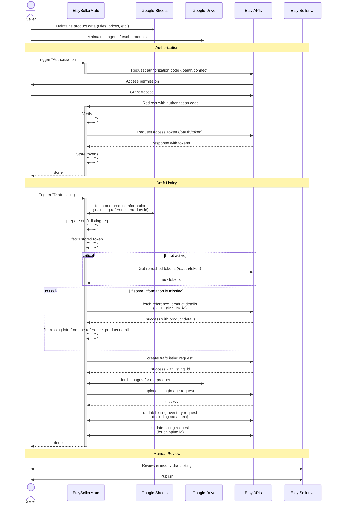

# 🧵 EtsySellerMate

**EtsySellerMate** is a private, non-commercial automation tool built to simplify product listing for **a single Etsy shop**.

It connects securely to the Etsy API using OAuth2 and automatically creates **draft listings** based on a predefined **Google Sheets** format maintained by the shop owner.

This project is not intended for public or commercial distribution — it is a private integration purpose-built to reduce manual work for one seller’s internal listing workflow.

---

## 🎯 Purpose

Manually creating listings on Etsy is repetitive when dealing with many products.
EtsySellerMate solves this by:

* Reading product information from a fixed Google Sheet (with columns for title, description, price, tags, reference product id, etc.)
* Upload images from the Google drive (predefined path)
* Fetch reference listed product infromation from Etsy, and those information which are missing in spreadsheet, get it from the reference product
* Creating draft listings automatically using Etsy’s authenticated API endpoints.
* Done

After this draft listing, owner can manually review, modify (if required) and publish the products.

No public users, marketplaces, or other Etsy shops are involved.
All data remains under the shop owner’s control.

---

## 🔐 Authentication & Security

* Uses Etsy’s **OAuth2** authorization flow.
* The seller logs in once to grant access to his/her own shop.
* Tokens are securely stored and refreshed automatically.
* No external users or third-party data access.

---

## 🔄 Workflow Overview

---

## 🧩 Short-term Future Plans

If this basic flow works as expected, below could be enhancements to make the process more simpler

* Publish the listing using EtsySellerMate (instead of manual step)
* Not only listing, but support updating already published listing data from spreadsheet (Price, inventory etc)
* Deactivate listing from spreadsheet using EtsySellerMate

---

## 📌 Key Points

* Built for **internal use** by **one Etsy shop**.
* Not accessible or useful for other sellers.
* No shared credentials, no multi-user access.
* Not hosted publicly — run locally or privately by the shop owner.
* Complies fully with Etsy’s API terms and data handling policies.

---

## 🧩 Long-term Future Plans (if approved)

In the future, the project may be **expanded into a commercial version**. But a seperate approval procedures will be followed at that time.

Supporting:

* Multiple shops can authorize individually.
* Each shop’s data remains isolated.
* A proper public OAuth flow and terms would be implemented.
* The app can be hosted publically.

Until then, this app is for **personal internal use only** and **not monetized**.

---

## 🧠 Author

**Chetan**
Creator of EtsySellerMate
Focused on simplifying repetitive tasks for Etsy sellers through automation.
