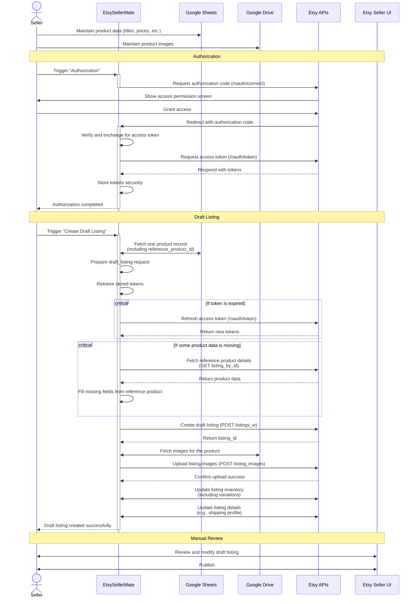

# 🧵 EtsySellerMate

**EtsySellerMate** is a private, non-commercial automation tool designed to simplify the product listing process for **a single Etsy shop**.

It connects securely to the Etsy API using OAuth2 and automatically creates **draft listings** based on a predefined **Google Sheets** format maintained by the shop owner.

This project is not intended for public or commercial distribution — it is a private integration built specifically to reduce manual work in one seller’s internal listing workflow.

---

## 🎯 Purpose

Manually creating listings on Etsy can be repetitive and time-consuming when managing many products.

EtsySellerMate addresses this by:

* Reading product information from a fixed Google Sheet (including title, description, price, tags, reference product ID, etc.).
* Uploading images from Google Drive (predefined folder path).
* Fetching reference product details from Etsy to fill in any missing fields in the spreadsheet.
* Creating draft listings automatically using Etsy’s authenticated API endpoints.
* Completing the process with a ready-to-review draft listing.

After the draft listing is created, the shop owner can manually review, adjust (if needed), and publish the products.

No public users, marketplaces, or other Etsy shops are involved.
All data remains entirely under the shop owner’s control.

---

## 🔐 Authentication & Security

* Uses Etsy’s **OAuth2** authorization flow.
* The seller logs in once to grant access to their own shop.
* Tokens are securely stored and refreshed automatically when needed.
* No external users or third-party data access is involved.

---

## 🔄 Workflow Overview

---

## 🧩 Short-Term Future Plans

If the current flow works as expected, the following enhancements may be added to further simplify the process:

* Publish listings directly from EtsySellerMate (instead of manually).
* Support updating already published listings from the spreadsheet (price, inventory, etc.).
* Deactivate listings directly from the spreadsheet using EtsySellerMate.

---

## 📌 Key Points

* Built for **internal use** by **one Etsy shop**.
* Not accessible or useful for other sellers.
* No shared credentials or multi-user access.
* Not hosted publicly — runs locally or privately by the shop owner.
* Fully compliant with Etsy’s API terms and data handling policies.

---

## 🧩 Long-Term Future Plans (if approved)

In the future, this project may evolve into a **commercial version**, following Etsy’s separate approval process.
Potential enhancements include:

* Supporting multiple Etsy shops, each authorized individually.
* Ensuring strict data isolation between shops.
* Implementing a proper public OAuth flow and user terms.
* Hosting the app publicly with an accessible dashboard.

Until then, this app remains **private**, **for internal use only**, and **not monetized**.

---

## 🧠 Author

**Chetan** -- Creator of EtsySellerMate -- Dedicated to simplifying repetitive tasks for Etsy sellers through smart automation.
